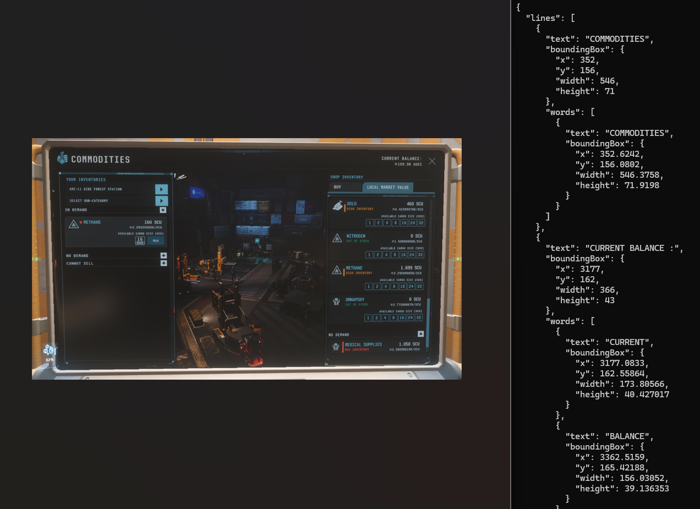

# Photos "Scan text" wrapper
This project is a C# port of https://github.com/b1tg/win11-oneocr. It wraps [Microsoft Photos' powerful OneOCR feature](https://learn.microsoft.com/en-us/answers/questions/2285914/how-to-extract-text-from-images-on-windows-11-arti) (the "Scan text" button) in a small executable, the output of which can then be programatically consumed.

For more information, you can consult the [original author's blog post](https://b1tg.github.io/post/win11-oneocr/).

## Usage
1. Download the [latest release](https://github.com/EtienneLamoureux/oneocr-wrapper/releases) .exe file, under the "Assets" section
1. Extract the application wherever
1. Acquire and place the [dependency DLLs](https://github.com/EtienneLamoureux/oneocr-wrapper?tab=readme-ov-file#dependencies) next to `OneOcrWrapper.exe`
1. Run `OneOcrWrapper.exe <image.png|bmp|jpg> [--pretty-print]` from the command-line or another program

### Example


## Development
### Dependencies
These dependencies must be placed at the root of the project for it to build. Only OpenCV is openly available. 
1. [opencv_world460.dll](https://github.com/opencv/opencv/releases/tag/4.6.0)
1. [oneocr.dll](https://github.com/b1tg/win11-oneocr/blob/2f300766a1f300f07bebcf6043e342761ad94b00/README.md)
1. [oneocr.onemodel](https://github.com/b1tg/win11-oneocr/blob/2f300766a1f300f07bebcf6043e342761ad94b00/README.md)
1. [onnxruntime.dll](https://github.com/b1tg/win11-oneocr/blob/2f300766a1f300f07bebcf6043e342761ad94b00/README.md)

N.B.: The program was only tested with DLLs from `SnippingTool 11.2409.25.0`

### Build
```cmd
dotnet build -c Release
```